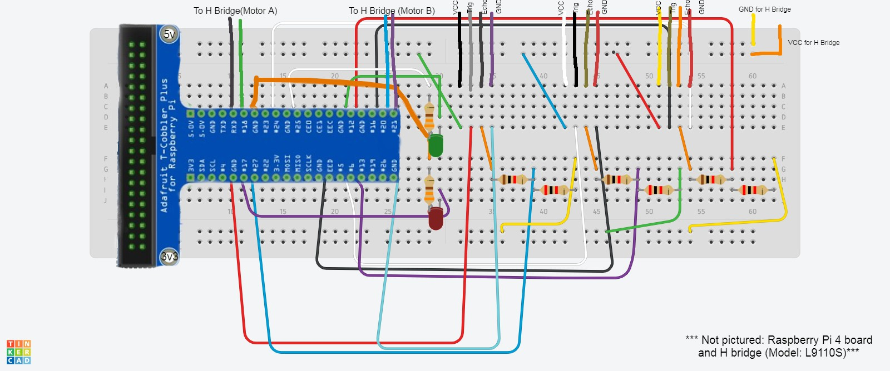

# Ball Tracking Robot 
 
The ball tracking robot uses image processing, which is done by a Pi cam and ultrasonic sensors to control motors on a robot. The robot is then able to track a ball of a specific color and moves towards it. In the course of completing this project, I was able to overcome many difficult issues such as having to rewire all my ultrasonic sensors and learned important lessons such as the importance of good communication skills.
 
| **Engineer** | **School** | **Area of Interest** | **Grade** |
|:--:|:--:|:--:|:--:|
| Drisha M | STEM High School | Electrical Engineering | Incoming Freshman

<!--- -->


# Final Thoughts and Demo 
<iframe width="560" height="315" src="https://www.youtube.com/embed/VGeotjvLdfQ?si=vG9NWZzbO_UzOVaB" title="YouTube video player" frameborder="0" allow="accelerometer; autoplay; clipboard-write; encrypted-media; gyroscope; picture-in-picture; web-share" referrerpolicy="strict-origin-when-cross-origin" allowfullscreen></iframe>

I am happy with the way my project has come out. I was able to complete the base project as well as add some modifications to it. This is my first step to making many more robots like this in the future.This was one of the best ways to spend my summer. As a class, we had so much fun together while also being very productive. Not only have I gained technical skills such as building robots, making circuits, and programming in Python which will help in future careers, but I have also improved my soft skills such as time management, problem solving, teamwork, and decision making. Words cannot express how grateful I am to have found a community of bright minds like this. I will be in contact with them for many years to come. I would like to think that I had entered BlueStamp with a growth mindset. But, after hearing the stories and philosophies of some of our guest speakers, my growth mindset has gotten even stronger and I want to learn and grow even more than I did before.   

# Final Milestone
<iframe width="560" height="315" src="https://www.youtube.com/embed/HpitgQfbUqg?si=x5LJbQNo_byRSDeX" title="YouTube video player" frameborder="0" allow="accelerometer; autoplay; clipboard-write; encrypted-media; gyroscope; picture-in-picture; web-share" referrerpolicy="strict-origin-when-cross-origin" allowfullscreen></iframe>

My final milestone was to finish up my project and add in a modification. I put all of my code for my motors, sensors, and camera into one file and added code to allow the robot to move based on where the ball was. For my modification, I added 2 LED lights. The green light turns on when the ball is detected and the red light turns on when the ball is not detected. My two main accomplishments during BlueStamp were understanding new code, and completing the project by myself with minimal help. 2 challenges I faced were meeting deadlines for the project, and making my final file of code work fully. The main things that I learned in the course of making this project are some basics of Raspberry Pi, Python, and building circuits. I was also able to improve my ability to communicate with others. In the end, my project is able to track a ball using image processing and is able to move towards it using motors and ultrasonic sensors. In the future after BlueStamp, I hope to make more modifications to this project such as adding an API and to make more robots similar to this one.  

# Second Milestone
<iframe width="560" height="315" src="https://www.youtube.com/embed/swTvoJJFWII?si=a95VOgHi7y5n98KX" title="YouTube video player" frameborder="0" allow="accelerometer; autoplay; clipboard-write; encrypted-media; gyroscope; picture-in-picture; web-share" referrerpolicy="strict-origin-when-cross-origin" allowfullscreen></iframe>

I have accomplished a lot since my last milestone. My last milestone was getting the robot’s motors to operate properly. Since then, I have also been able to program the ultrasonic sensors to detect how far an object is in front of it. When the project is complete, the sensors will be used to detect how far away the ball is and the motors will move the robot closer to the ball. My second milestone is being able to do image processing on an image taken by the Pi Camera. The main issue I faced during this milestone was my Pi Camera stopped working. I had to complete all my code without having a camera to test it with immediately. When the new camera came, it was able to turn the background black and turn the ball white. This project surprised me because the code is a lot simpler than expected. My next step is to put code from each of my components together and add in a modification. 


# First Milestone
<iframe width="560" height="315" src="https://www.youtube.com/embed/u2Y0N68iUdk?si=f_fSw-ynnUQXgp3q" title="YouTube video player" frameborder="0" allow="accelerometer; autoplay; clipboard-write; encrypted-media; gyroscope; picture-in-picture; web-share" referrerpolicy="strict-origin-when-cross-origin" allowfullscreen></iframe>

The main parts of my project are the Raspberry Pi, the Pi camera, the motors, and the ultrasonic sensors. All of these components will be connected to the robot car chassis. The Raspberry Pi will be controlling the robot. So far, I have been able to assemble the car chassis, take images and videos from the Pi camera, and run the motors. I faced challenges when connecting the H bridge, the motors, and the Raspberry Pi. The H bridge is a small circuit that is used to control the motors. I solved this problem by researching on my own and found helpful websites to connect the components. I would like to connect my ultrasonic sensors and do image processing next.  

 
# Schematics 


# Code
```
from picamera2.encoders import H264Encoder
from picamera2 import Picamera2
import time
import cv2 
import numpy as np
from gpiozero import Motor
from gpiozero import DistanceSensor
import RPi.GPIO as GPIO 

#Ultrasonic Sensors
def distanceSensors(): 
    ultrasonic1 = DistanceSensor(echo=17, trigger=4, threshold_distance=0.5)
    ultrasonic2 = DistanceSensor(echo=6, trigger=5, threshold_distance=0.5)
    ultrasonic3 = DistanceSensor(echo=12, trigger=16, threshold_distance=0.5)

    return ultrasonic1.distance*100, ultrasonic2.distance*100, ultrasonic3.distance*100 
#Motors
motor1 = Motor(21, 20)
motor2 = Motor(15, 14)

def forward():
    motor1.forward()
    motor2.forward()
def backward():
    motor1.backward()
    motor2.backward()
def left():
    motor1.stop()
    motor2.forward()
def right():
    motor1.forward()
    motor2.stop()
def sharpLeft():
    motor1.backward()
    motor2.forward()
def sharpRight():
    motor1.forward()
    motor2.backward()
def stop():
    motor1.stop()
    motor2.stop()
    
def find_blob(blob):  
    largest_contour=0
    cont_index=0
    contours, hierarchy = cv2.findContours(blob, cv2.RETR_CCOMP, cv2.CHAIN_APPROX_SIMPLE)
    for idx, contour in enumerate(contours):
        area=cv2.contourArea(contour)
        if (area >largest_contour) :
            largest_contour=area
            cont_index=idx                    
    r=(0,0,2,2)
    if len(contours) > 0:
        r = cv2.boundingRect(contours[cont_index])
    return r,largest_contour

#LED Modifciation   
GPIO.setmode(GPIO.BCM)
GPIO.setwarnings(False)
GPIO.setup(23, GPIO.OUT)
GPIO.setup(18, GPIO.OUT)
GPIO.output(23, GPIO.LOW)
GPIO.output(18, GPIO.LOW)

def led_green():
    GPIO.output(23, GPIO.HIGH)
    GPIO.output(18, GPIO.LOW)

def led_red():
    GPIO.output(23, GPIO.LOW)
    GPIO.output(18, GPIO.HIGH)
    
global center_x
global center_y
global found
global largeNumberArea
global smallNumberArea
global lowerRange
global upperRange 
center_x=0
center_y=0
found = 0
largeNumberArea = 250000
smallNumberArea = 100000
leftRange = 400
rightRange = 1520

picam2 = Picamera2()
video_config = picam2.create_video_configuration(main={"size": (1920, 1080)}, lores={"size": (480, 270)}, display="lores")
picam2.configure(video_config)
encoder = H264Encoder(bitrate=10000000)
output = "myVideo.h264"
picam2.start_recording(encoder, output)

while True:	
    im = picam2.capture_array()
    cv2.imwrite('ballImage.png', im)
    found = 1
    leftSensorFlag = 0
    middleSensorFlag = 0
    rightSensorFlag = 0 
    if found == 1:
        #Call ultrasonic sensors
        leftSensor, middleSensor, rightSensor = distanceSensors()
        print("Sensor 1: ", leftSensor)
        print("Sensor 2: ", middleSensor)
        print("Sensor 3: ", rightSensor)
        if (leftSensor > 5 and leftSensor < 100):
            leftSensorFlag = 1
        if (middleSensor > 5 and middleSensor < 100):
            middleSensorFlag = 1
        if (rightSensor > 5 and rightSensor < 100):
            rightSensorFlag = 1
        if (leftSensorFlag == 1 or middleSensorFlag == 1 or rightSensorFlag == 1):
            sensorFlag = 1
            print("SensorFlag:",  sensorFlag)
        #Find the masked image 
        frame = im[:,:,[0,1,2]] 
        hsv_img = cv2.cvtColor(frame, cv2.COLOR_RGB2HSV)
        mask_1 = cv2.inRange(hsv_img, np.array([155,190,1]), np.array([190,255,255]))
        cv2.imwrite('mask1img.png', mask_1)
        mask = mask_1
        cv2.imwrite('maskimg.png', mask)
        kern_dilate = np.ones((4,4), np.uint8)
        kern_erode  = np.ones((4,4), np.uint8)
        mask= cv2.erode(mask,kern_erode)
        mask=cv2.dilate(mask,kern_dilate)
        (h,w) = mask.shape
        #cv2.imshow('maskimg.png', mask)
        #Find the area 
        positions, area = find_blob(mask)
        print(area)
        x,y,w,h = positions
        #print(x)
        center_x  =x + w/2
        center_y  =y + h/2

        if (area < largeNumberArea and area > smallNumberArea and sensorFlag == 1):
            #Green light on
            led_green()
            #reset found value
            print ("Found:", found)
            found = 0
            print("center X" ,center_x)
            if center_x > 0 and center_x < leftRange:
                print("centerLeft X" ,center_x)
                sharpLeft()
                
            elif center_x < 1920 and center_x > rightRange:
                print("centerRight X" ,center_x)
                sharpRight()
            else: 
                print("centerForward X" ,center_x)
                forward()
        else:
            stop()
            #Red light on
            led_red()
            found = 0 
        continue 
picam2.stop_recording()
```

# Bill of Materials

| **Part** | **Note** | **Price** | **Link** |
|:--:|:--:|:--:|:--:|
| Elegoo Electronics Fun Kit | Contains various electronic components as well as a breadboard| $9.99 | <a href="https://www.amazon.com/EL-CK-002-Electronic-Breadboard-Capacitor-Potentiometer/dp/B01ERP6WL4/ref=asc_df_B01ERP6WL4/?tag=hyprod-20&linkCode=df0&hvadid=693615855514&hvpos=&hvnetw=g&hvrand=9959102661946103538&hvpone=&hvptwo=&hvqmt=&hvdev=c&hvdvcmdl=&hvlocint=&hvlocphy=9052344&hvtargid=pla-562895947159&mcid=9cae1398299332c592e9e59d7108c20c&gad_source=1&th=1"> Link </a> |
| Energizer AA Batteries(4 used) | Were used to power motors | $14.99 | <a href="https://www.amazon.com/dp/B07TXNX6S2?maas=maas_adg_53DCFBEA673C1C0C7351881105D732BE_afap_abs&ref_=aa_maas&tag=maas&gad_source=1&gclid=CjwKCAjw1emzBhB8EiwAHwZZxZpMZYsEWIWfRSGnGvtqCww3F0k5mB03BIMeWqSbuTqQHCXBoDtkihoCsosQAvD_BwE&gclsrc=aw.ds&th=1"> Link </a> |
| Sixthgu Portable Power Bank (1 used)| Used to power Rasperberry Pi | $15.99 | <a href="https://www.amazon.com/SIXTHGU-Portable-Charger-Charging-Flashlight/dp/B0C7PHKKNK/ref=asc_df_B0C7PHKKNK/?tag=hyprod-20&linkCode=df0&hvadid=693712892611&hvpos=&hvnetw=g&hvrand=16665950822110873731&hvpone=&hvptwo=&hvqmt=&hvdev=c&hvdvcmdl=&hvlocint=&hvlocphy=9052344&hvtargid=pla-2204160034749&mcid=fa87eab63bd530549bbb5781886dab89&gad_source=1&th=1"> Link </a> |
| 32 in 1 Screwdriver Set | Used to build robot car chassis | $6.99 | <a href="https://www.amazon.com/Small-Screwdriver-Set-Mini-Magnetic/dp/B08RYXKJW9"> Link </a> |
| TT Gearbox Motor(2 used) | Used to make wheels on robot move | $10.99 | <a href="https://www.amazon.com/AEDIKO-Motor-Gearbox-200RPM-Ratio/dp/B09N6NXP4H/ref=asc_df_B09N6NXP4H/?tag=hyprod-20&linkCode=df0&hvadid=693399102390&hvpos=&hvnetw=g&hvrand=5299691174750967451&hvpone=&hvptwo=&hvqmt=&hvdev=c&hvdvcmdl=&hvlocint=&hvlocphy=9052344&hvtargid=pla-1637610743750&psc=1&mcid=bbadcc677add36f692ca69802ba37513&gad_source=1"> Link </a> |
| Emozny Robot Car Chassis Kit | Acts as the base for the ball tracking robot | $12.99 | <a href="https://www.amazon.com/Smart-Chassis-Motors-Encoder-Battery/dp/B01LXY7CM3/ref=asc_df_B01LXY7CM3/?tag=hyprod-20&linkCode=df0&hvadid=693448563566&hvpos=&hvnetw=g&hvrand=3650067821143406173&hvpone=&hvptwo=&hvqmt=&hvdev=c&hvdvcmdl=&hvlocint=&hvlocphy=9052344&hvtargid=pla-584495246069&psc=1&mcid=3f54405bf4d93ae384d78ef10f75b962&gad_source=1"> Link </a> |
| AstroAI Multimeter Tester | Measures voltage and ohms| $12.99 | <a href="https://www.amazon.com/AstroAI-Digital-Multimeter-Voltage-Tester/dp/B01ISAMUA6/ref=asc_df_B01ISAMUA6/?tag=hyprod-20&linkCode=df0&hvadid=693070740235&hvpos=&hvnetw=g&hvrand=14579879261594192980&hvpone=&hvptwo=&hvqmt=&hvdev=c&hvdvcmdl=&hvlocint=&hvlocphy=9052344&hvtargid=pla-379007186802&psc=1&mcid=e995faa2fd8a33b8811e7e950fb100e9&gad_source=1"> Link </a> |
| Raspberry Pi Camera Module | When connected to the Raspberry Pi, it is able to take photos and videos | $17.99 | <a href="https://www.amazon.com/Raspberry-Pi-Camera-Module-Megapixel/dp/B01ER2SKFS/ref=asc_df_B01ER2SKFS/?tag=hyprod-20&linkCode=df0&hvadid=693442483832&hvpos=&hvnetw=g&hvrand=12253194615247897850&hvpone=&hvptwo=&hvqmt=&hvdev=c&hvdvcmdl=&hvlocint=&hvlocphy=9052344&hvtargid=pla-406302832745&mcid=946fcdccb9973acc91f2c08c4c6490a9&gad_source=1&th=1"> Link </a> | 
| DC Moter Drive Controller Board(1 used) | Used to control moters | $5.50 | <a href="https://www.amazon.com/HiLetgo-H-bridge-Stepper-Controller-Arduino/dp/B00M0F243E/ref=sr_1_1?dib=eyJ2IjoiMSJ9.K2SjOJTkN5F85Zns_dU3YdjbUosjZIECiWiT2TWhi6hjwuuV0CxeHZQ5pN-1bhiA_NQpkxBlWe1YXbMRVKFSQYxOfmrTcQZvdeE5qXWKyTCTpuoUnjyj0Qt7WSxweMdrLOBgBzlwd4oqgdLiIEaDfFa5JhOoGGnn0KAMiSeHlxnmUSN14fmuKtWg7m3Y0qOXq0UUBlIAtwAKhiyJUqklXNEpxUoBix0yxv_KX-hqOQwb79PJ4x2iZ1tQh_BcJ8__ZxoFHJ5SkzmkE93LZmvuLrT6BANZfZEPVjrmz4j669w.dXG6iLoc8wOiuas-2XvFY_SOZJeHVZGdFR85eOcEdUw&dib_tag=se&hvadid=409940659656&hvdev=c&hvlocphy=9052344&hvnetw=g&hvqmt=e&hvrand=15791150144840405235&hvtargid=kwd-300973309866&hydadcr=24656_11410731&keywords=l9110s+motor+driver&qid=1719375172&sr=8-1"> Link </a> | 
| Ultrasonic Sensors with housing | Are able to detect how far away an object is | $9.49 | <a href="https://www.amazon.com/WWZMDiB-Ultrasonic-Sensor-Raspberry-HC-SR04/dp/B0C166NX3Z/ref=asc_df_B0C166NX3Z/?tag=hyprod-20&linkCode=df0&hvadid=693411594200&hvpos=&hvnetw=g&hvrand=15413222228880657023&hvpone=&hvptwo=&hvqmt=&hvdev=c&hvdvcmdl=&hvlocint=&hvlocphy=9052344&hvtargid=pla-2197607558769&psc=1&mcid=b102a4193abc323e86158bd5dd7608dd&gad_source=1"> Link </a> | 
| Larger breadboard(Modification) | Allows for more space for circuit wiring | $10.99 | <a href="https://www.amazon.com/830-Point-Solderless-Breadboard-Prototyping-Classroom/dp/B00B88630E/ref=sr_1_10?dib=eyJ2IjoiMSJ9.EDMNBYDSTjBv81G_g5_5U_5k7thC8K3WqEMostOvqDtsL6HmGhG8z0SyqJYdkjcnEznc8yZ5mrX9TgXTvEUCAuFkUNutt-n69IZd-cyvYCdw_UuWXqvuLPYjZy2324fgHFlKOVV4MbaxQOE_-Got2OXs7YZLQlB6Igpv2pAPli5oMJfrKxitEAkRaiJwrYMIyN3H6DvoSoa9R7lkXOHPCETjLd6bXe1vhdK_s3b54Cw.dNW1OA31YAmy5r_w-yW9R2hRAakgofdFBTPAMHK_fC4&dib_tag=se&hvadid=570570157661&hvdev=c&hvlocphy=9028763&hvnetw=g&hvqmt=e&hvrand=11015565406265513908&hvtargid=kwd-478051304141&hydadcr=13934_13379011&keywords=breadboards+amazon&qid=1719442731&sr=8-10"> Link </a> | 
| Pi T-Cobbler(Modification) | Allows connection between the breadboard and Raspberry Pi. Results in cleaner and easier to manage wiring | $7.95 | <a href="https://www.amazon.com/Adafruit-2028-Assembled-T-Cobbler-Plus/dp/B00OG4X0DK/ref=sr_1_fkmr0_1?crid=D4E29ACAL53G&dib=eyJ2IjoiMSJ9.rtXqZ75RlcNotNKyBTiETkWNTLrawhtoJT4PBjxXk0Q.cY_30jhShUVgshTU0pk0GBxz4sBP75DXORZGsyZ73Gk&dib_tag=se&keywords=t+pi+cobbler+with+5v+and+3v3&qid=1719442800&sprefix=t+pi+cobbler+with+5v+and+3v3%2Caps%2C102&sr=8-1-fkmr0"> Link </a> | 
| Arducam(Replacement) | When connected to the Raspberry Pi, it is able to take photos and videos | $6.99 | <a href="https://www.amazon.com/Arducam-Megapixels-Sensor-OV5647-Raspberry/dp/B012V1HEP4/ref=asc_df_B012V1HEP4/?tag=hyprod-20&linkCode=df0&hvadid=693620629591&hvpos=&hvnetw=g&hvrand=7199533373023029001&hvpone=&hvptwo=&hvqmt=&hvdev=c&hvdvcmdl=&hvlocint=&hvlocphy=9028763&hvtargid=pla-820020083673&mcid=75fa5b0480f739c29fa68a28d965eee9&gad_source=1&th=1"> Link </a> |

# Other Resources/Examples
- [Motor Wiring](https://projects.raspberrypi.org/en/projects/physical-computing/14 )
- [Ultrasonic Sensor Wiring](https://projects.raspberrypi.org/en/projects/physical-computing/12)
- [Image processing](https://docs.opencv.org/4.x/df/d9d/tutorial_py_colorspaces.html)
